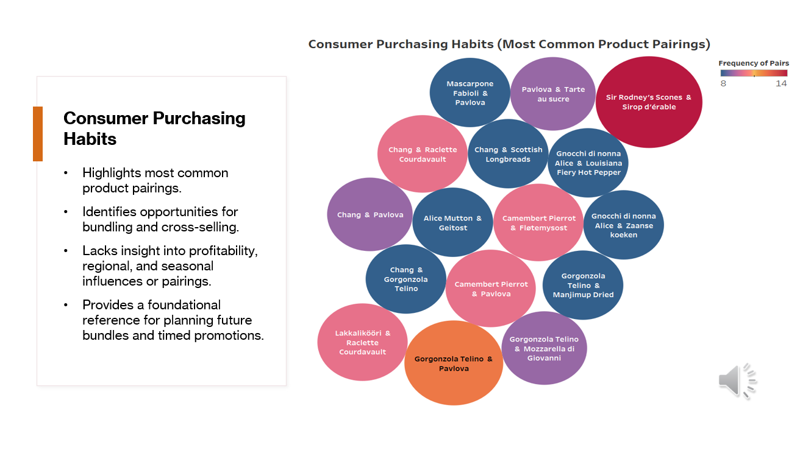

# 📦 Northwind Traders Sales Analysis (Team Project)

## 🔍 Overview
This project involved evaluating sales data for the fictional company **Northwind Traders** to identify underperforming products, generate business insights, and develop strategic recommendations.

As the **team lead**, I was responsible for organizing our workflow, setting deadlines, and ensuring consistent communication across our group. I also contributed directly to the sales analysis and co-authored a product performance RFP focused on underperforming product categories. Our work culminated in a formal presentation, which you can [watch here](https://www.youtube.com/watch?v=Lgqg3GZ4gBc).

> **Note**: The dataset used was simulated and intended for educational purposes only.

## 🧰 Tools Used
- Tableau (Data visualization)
- Excel (Data analysis)
- PowerPoint (Presentation design)

## 💡 Key Contributions
- Identified bottom-performing product categories using Tableau dashboards
- Co-wrote an RFP focused on increasing sales of stagnant product lines
- Collaborated on a BLUF-style executive summary for senior leadership
- Presented findings and recommendations in a 6-minute video pitch

## 🎥 Final Presentation
### [Watch on YouTube](https://www.youtube.com/watch?v=Lgqg3GZ4gBc)
  
## 📊 My Slides

Here are the presentation slides I personally created and contributed to:

### Revenue Trends Slide

### Purchasing Habits Slide

## 📎 Project Materials
- 📄 [Final Report](FinalAnalysis.pdf)
- 📊 [Raw Dataset](RawNorthwindTradersData.xlsx)

## 📫 About Me
Hi, I’m Mary Bridges, a Business Data Analytics student with a passion for turning raw data into meaningful insights. I thrive at the intersection of data, design, & storytelling, and I love working on projects that inform strategy and create impact.
